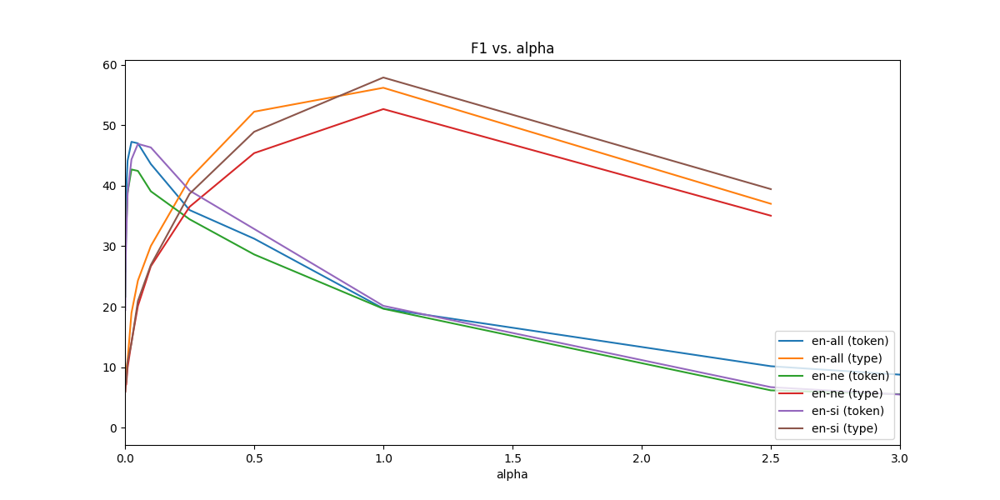

# Morphological / BPE segmentation experiments



## Hyperparameter tuning for Morfessor Baseline (dampening)

- Uses dampening, i.e. type-level training

- For each of `EN-SI` and `EN-NE` we take the English vocabulary in the corpus, train a Morfessor Baseline model using each `alpha`-value (i.e. "corpus weight") from table below, and record the **F1-score** as computed on the Morpho Challenge 2010 gold analyses.

- Additionally, we concatenate the English sides of both corpora and train Morfessor Baseline on this combined data set.

### EN - SI

```
alpha   f1
0.001	5.95
0.0025	7.20
0.005	7.62
0.01	10.89
0.025	13.99
0.05	20.96
0.1	26.90
0.25	38.67
0.5	48.92
1.0	57.89
2.5	39.44
5.0
10.0
12.5
15.0
17.5
20.0
22.25
25.0
50.0
100.0
125.0
150.0
175.0
200.0
225.0
250.0
275.0
300.0
```

Best `alpha` = 1.0

Note: Empty F1 score means the scoring crashed. The most likely reason for this is the fact that words aren't segmented at all, which seems to happen with type-level training.

#### Verbose score of best config

```
% tail -3 mbl.corpusweight1.0.score
TOTAL. Precision: 63.25%; non-affixes: 63.25%; affixes: 100.00%
TOTAL. Recall:    53.36%; non-affixes: 54.87%; affixes: 51.92%
TOTAL. F-measure: 57.89%; non-affixes: 58.76%; affixes: 68.35%
```

#### Sample segmentations from best config

```
% shuf -n 10 mbl.corpusweight*.segm4eval.en --random-source=../../../corpus-weights
floors	floor s
loadable	load able
outlet	out let
tami	tami
al-ithnain	al - ith na in
close-range	close - range
ellis.a	elli s . a
hiccupping	hiccup ping
marietta	mari etta
pact	pac t
```

#### Sample segmentations from garbage config (cw=5.0)

```
% shuf -n 10 mbl.corpusweight*.segm4eval.en --random-source=../../../corpus-weights
floors	floors
loadable	loadable
outlet	outlet
tami	tami
al-ithnain	al-ithnain
close-range	close-range
ellis.a	ellis.a
hiccupping	hiccupping
marietta	marietta
pact	pact
```

Note how nothing is segmented when the `alpha` is garbage!

### EN - NE

```
alpha   f1
0.001	6.01
0.0025	6.94
0.005	7.16
0.01	9.94
0.025	14.12
0.05	20.14
0.1	26.69
0.25	36.52
0.5	45.39
1.0	52.67
2.5	35.05
5.0
10.0
12.5
15.0
17.5
20.0
22.25
25.0
50.0
100.0
125.0
150.0
175.0
200.0
225.0
250.0
275.0
300.0
```

Best `alpha` = 1.0

Note: Empty F1 score means the scoring crashed. The most likely reason for this is the fact that words aren't segmented at all, which seems to happen with type-level training.

#### Verbose score of best config

```
% tail -3 mbl.corpusweight1.0.score
TOTAL. Precision: 65.93%; non-affixes: 65.93%; affixes: 100.00%
TOTAL. Recall:    43.85%; non-affixes: 44.71%; affixes: 43.17%
TOTAL. F-measure: 52.67%; non-affixes: 53.28%; affixes: 60.30%
```

#### Sample segmentations from best config

```
% shuf -n 10 mbl.corpusweight*.segm4eval.en --random-source=../../../corpus-weights
cinépata.com	cinépata .com
cinnamon	c in na mon
clemens	clem en s
!	!
ciphers	cipher s
coffin	co f fin
benito	beni to
checkxml	check xml
circuit	circuit
benjamites	benjamite s
```

#### Sample segmentations from garbage config (cw=5.0)

```
% shuf -n 10 mbl.corpusweight*.segm4eval.en --random-source=../../../corpus-weights
cinépata.com	cinépata.com
cinnamon	cinnamon
clemens	clemens
!	!
ciphers	ciphers
coffin	coffin
benito	benito
checkxml	checkxml
circuit	circuit
benjamites	benjamites
```

Note again how nothing is segmented with a garbage `alpha`.

### Combined

```
alpha   f1
0.001	7.04
0.0025	7.46
0.005	9.68
0.01	11.09
0.025	18.96
0.05	24.33
0.1	30.04
0.25	41.15
0.5	52.24
1.0	56.19
2.5	37.02
5.0
10.0
12.5
15.0
17.5
20.0
22.25
25.0
50.0
100.0
125.0
150.0
175.0
200.0
225.0
250.0
275.0
300.0
```

Best `alpha` = 1.0

Note: Empty F1 score means the scoring crashed. The most likely reason for this is the fact that words aren't segmented at all, which seems to happen with type-level training.

#### Verbose score of best config

```
% tail -3 mbl.corpusweight1.0.score
TOTAL. Precision: 66.21%; non-affixes: 66.21%; affixes: 100.00%
TOTAL. Recall:    48.81%; non-affixes: 51.78%; affixes: 45.67%
TOTAL. F-measure: 56.19%; non-affixes: 58.11%; affixes: 62.71%
```

#### Sample segmentations from best config

```
% shuf -n 10 mbl.corpusweight*.segm4eval.en --random-source=../../../corpus-weights
corin	cor in
comspr	com s pr
8.50	8 .50
mag	mag
erred	er red
goldinger	gold ing er
alleys	alley s
honest	honest
seein	see in
bekah	be kah
```

#### Sample segmentations from garbage config (cw=5.0)

```
% shuf -n 10 mbl.corpusweight*.segm4eval.en --random-source=../../../corpus-weights
corin	corin
comspr	comspr
8.50	8.50
mag	mag
erred	erred
goldinger	goldinger
alleys	alleys
honest	honest
seein	seein
bekah	bekah
```

Note again how nothing is segmented with a garbage `alpha`.

## Hyperparameter tuning for Morfessor Baseline (no dampening)

- No dampening, i.e. token-level training

- For each of `EN-SI` and `EN-NE` we take the English vocabulary in the corpus, train a Morfessor Baseline model using each `alpha`-value (i.e. "corpus weight") from table below, and record the **F1-score** as computed on the Morpho Challenge 2010 gold analyses.

- Additionally, we concatenate the English sides of both corpora and train Morfessor Baseline on this combined data set.


### EN - SI

```
alpha   f1
0.001	19.46
0.0025	27.41
0.005	31.77
0.01	38.72
0.025	44.34
0.05	46.92
0.1	46.33
0.25	39.20
0.5	32.86
1.0	20.15
2.5	6.71
5.0	0.61
10.0	0.24
12.5	0.24
15.0	0.24
17.5	0.24
20.0	0.17
22.25	0.17
25.0	0.17
50.0	0.17
100.0	0.17
125.0	0.17
150.0	0.17
175.0	0.17
200.0	0.17
225.0	0.17
250.0	0.17
275.0	0.17
300.0	0.17
```

Best `alpha` = 0.05

#### Verbose score of best config

```
% tail -3 *.score
TOTAL. Precision: 45.68%; non-affixes: 45.68%; affixes: 100.00%
TOTAL. Recall:    48.24%; non-affixes: 58.63%; affixes: 38.30%
TOTAL. F-measure: 46.92%; non-affixes: 51.35%; affixes: 55.38%
```

#### Sample segmentations from best config

```
% shuf -n 10 mbl.corpusweight*.segm4eval.en --random-source=../../../corpus-weights
floors	floor s
loadable	load able
outlet	out let
tami	tam i
al-ithnain	al - i th na in
close-range	close - range
ellis.a	ellis . a
hiccupping	hi c cup ping
marietta	mar i et ta
pact	p act
```

#### Sample segmentations from garbage config (cw=5.0)

```
% shuf -n 10 mbl.corpusweight*.segm4eval.en --random-source=../../../corpus-weights
floors	floors
loadable	load able
outlet	out let
tami	tami
al-ithnain	al-ithnain
close-range	close-range
ellis.a	ellis.a
hiccupping	hiccupping
marietta	marietta
pact	pact
```

### EN - NE

```
alpha   f1
0.001	21.66
0.0025	29.23
0.005	33.27
0.01	38.85
0.025	42.69
0.05	42.45
0.1	39.08
0.25	34.46
0.5	28.64
1.0	19.67
2.5	6.18
5.0	3.01
10.0	0.59
12.5	0.59
15.0	0.59
17.5	0.41
20.0	0.41
22.25	0.41
25.0	0.41
50.0	0.41
100.0	0.04
125.0	0.04
150.0	0.04
175.0	0.04
200.0	0.04
225.0	0.04
250.0	0.04
275.0	0.04
300.0	0.04
```
Best `alpha` = 0.025

#### Verbose score of best config

```
% tail -3 *.score
TOTAL. Precision: 35.32%; non-affixes: 35.32%; affixes: 100.00%
TOTAL. Recall:    53.96%; non-affixes: 59.27%; affixes: 49.76%
TOTAL. F-measure: 42.69%; non-affixes: 44.26%; affixes: 66.45%
```

#### Sample segmentations from best config

```
% shuf -n 10 mbl.corpusweight*.segm4eval.en --random-source=../../../corpus-weights
cinépata.com	c in é pa ta . com
cinnamon	c in n am on
clemens	cle men s
!	!
ciphers	cipher s
coffin	c of f in
benito	be ni to
checkxml	check xml
circuit	circuit
benjamites	be n ja m ite s
```

#### Sample segmentations from garbage config (cw=5.0)

```
% shuf -n 10 mbl.corpusweight*.segm4eval.en --random-source=../../../corpus-weights
cinépata.com	cinépata.com
cinnamon	cinnamon
clemens	clemens
!	!
ciphers	ciphers
coffin	coffin
benito	beni to
checkxml	check xml
circuit	circuit
benjamites	benjamites
```

### Combined

```
alpha   f1
0.001	25.84
0.0025	34.26
0.005	39.39
0.01	44.14
0.025	47.26
0.05	47.01
0.1	43.59
0.25	35.98
0.5	31.25
1.0	19.71
2.5	10.17
5.0	3.20
10.0	1.07
12.5	0.81
15.0	0.48
17.5	0.48
20.0	0.48
22.25	0.48
25.0	0.48
50.0	0.22
100.0	0.22
125.0	0.22
150.0	0.22
175.0	0.22
200.0	0.22
225.0	0.22
250.0	0.22
275.0	0.22
300.0	0.22
```

Best `alpha` = 0.025

#### Verbose score of best config

```
% tail -3 *.score
TOTAL. Precision: 42.39%; non-affixes: 42.39%; affixes: 100.00%
TOTAL. Recall:    53.41%; non-affixes: 61.49%; affixes: 44.89%
TOTAL. F-measure: 47.26%; non-affixes: 50.18%; affixes: 61.96%
```

#### Sample segmentations from best config

```
% shuf -n 10 mbl.corpusweight*.segm4eval.en --random-source=../../../corpus-weights
corin	cor in
comspr	com s pr
8.50	8 . 50
mag	mag
erred	er red
goldinger	gold i ng er
alleys	all ey s
honest	honest
seein	see in
bekah	be k ah
```

#### Sample segmentations from garbage config (cw=5.0)

```
% shuf -n 10 mbl.corpusweight*.segm4eval.en --random-source=../../../corpus-weights
corin	corin
comspr	comspr
8.50	8.50
mag	mag
erred	erred
goldinger	goldinger
alleys	alleys
honest	honest
seein	see in
bekah	bekah
```

## Notes
- `src/indic` taken from main [FLoRes repo](https://github.com/j0ma/flores)
- `download-data.sh` is also from flores, with slight path modifications. Same goes for `prepare-*.sh`
    - note: the script downloads excess data
