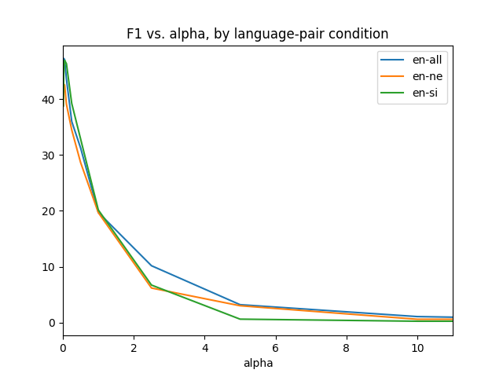

# Morphological / BPE segmentation experiments

# Hyperameter tuning for Morfessor Baseline

- For each of `EN-SI` and `EN-NE` we take the English vocabulary in the corpus, train a Morfessor Baseline model using each `alpha`-value (i.e. "corpus weight") from table below, and record the **F1-score** as computed on the Morpho Challenge 2010 gold analyses.

- Additionally, we concatenate the English sides of both corpora and train Morfessor Baseline on this combined data set.



### EN - SI

```
alpha   f1
0.01	38.72
0.025	44.34
0.05	46.92
0.1	46.33
0.25	39.20
0.5	32.86
1.0	20.15
2.5	6.71
5.0	0.61
10.0	0.24
12.5	0.24
15.0	0.24
17.5	0.24
20.0	0.17
22.25	0.17
25.0	0.17
50.0	0.17
100.0	0.17
125.0	0.17
150.0	0.17
175.0	0.17
200.0	0.17
225.0	0.17
250.0	0.17
275.0	0.17
300.0	0.17
```

Best `alpha` = 0.05

#### Verbose score of best config

```
% tail -3 mbl.corpusweight0.05.score          20-07-11 - 18:10:34
TOTAL. Precision: 45.68%; non-affixes: 45.68%; affixes: 100.00%
TOTAL. Recall:    48.24%; non-affixes: 58.63%; affixes: 38.30%
TOTAL. F-measure: 46.92%; non-affixes: 51.35%; affixes: 55.38%
```

#### Sample segmentations from best config

```
% shuf -n 5 mbl.corpusweight0.05.segm4eval.en --random-source=../../corpus-weights
floors	floor s
lonneman	l on n e man
protest	pro test
tempered	temp er ed
apparel	app ar el
```

#### Sample segmentations from garbage config

```
% shuf -n 5 mbl.corpusweight5.0.segm4eval.en --random-source=../../corpus-weights
floors	floors
lonneman	lonneman
protest	protest
tempered	tempered
apparel	apparel
```

### EN - NE

```
alpha   f1
0.01	38.85
0.025	42.69
0.05	42.45
0.1	39.08
0.25	34.46
0.5	28.64
1.0	19.67
2.5	6.18
5.0	3.01
10.0	0.59
12.5	0.59
15.0	0.59
17.5	0.41
20.0	0.41
22.25	0.41
25.0	0.41
50.0	0.41
100.0	0.04
125.0	0.04
150.0	0.04
175.0	0.04
200.0	0.04
225.0	0.04
250.0	0.04
275.0	0.04
300.0	0.04
```
Best `alpha` = 0.025

#### Verbose score of best config

```
% tail -3 mbl.corpusweight0.025.score         20-07-11 - 18:20:05
TOTAL. Precision: 35.32%; non-affixes: 35.32%; affixes: 100.00%
TOTAL. Recall:    53.96%; non-affixes: 59.27%; affixes: 49.76%
TOTAL. F-measure: 42.69%; non-affixes: 44.26%; affixes: 66.45%
```

#### Sample segmentations from best config

```
% shuf -n 5 mbl.corpusweight0.025.segm4eval.en --random-source=../../corpus-weights
cinépata.com	c in é pa ta . com
cinneroth	c in ner oth
benin	be n in
checksum	check sum
coffeyville	c of fe y ville
```

#### Sample segmentations from garbage config

```
% shuf -n 5 mbl.corpusweight5.0.segm4eval.en --random-source=../../corpus-weights
cinépata.com	cinépata.com
cinneroth	cinneroth
benin	benin
checksum	checksum
coffeyville	coffeyville
```

### Combined

```
alpha   f1
0.01	44.14
0.025	47.26
0.05	47.01
0.1	43.59
0.25	35.98
0.5	31.25
1.0	19.71
2.5	10.17
5.0	3.20
10.0	1.07
12.5	0.81
15.0	0.48
17.5	0.48
20.0	0.48
22.25	0.48
25.0	0.48
50.0	0.22
100.0	0.22
125.0	0.22
150.0	0.22
175.0	0.22
200.0	0.22
225.0	0.22
250.0	0.22
275.0	0.22
300.0	0.22
```

Best `alpha` = 0.025

#### Verbose score of best config

```
% tail -3 mbl.corpusweight0.025.score         20-07-11 - 18:24:12
TOTAL. Precision: 42.39%; non-affixes: 42.39%; affixes: 100.00%
TOTAL. Recall:    53.41%; non-affixes: 61.49%; affixes: 44.89%
TOTAL. F-measure: 47.26%; non-affixes: 50.18%; affixes: 61.96%
```

#### Sample segmentations from best config

```
% shuf -n 5 mbl.corpusweight0.025.segm4eval.en --random-source=../../corpus-weights
corin	cor in
confounds	con found s
apar-	a par -
malmö	mal m ö
eyeing	eye ing
```

#### Sample segmentations from garbage config

```
% shuf -n 5 mbl.corpusweight5.0.segm4eval.en --random-source=../../corpus-weights
corin	corin
confounds	confound s
apar-	apar-
malmö	malmö
eyeing	eyeing
```

## Notes
- `src/indic` taken from main [FLoRes repo](https://github.com/j0ma/flores)
- `download-data.sh` is also from flores, with slight path modifications. Same goes for `prepare-*.sh`
    - note: the script downloads excess data
- `src/create-flores-vocabulary.py` uses `sacremoses` for tokenizing English. Segmentations are **NOT** learned from untokenized text like with `SentencePiece` in the original Flores paper.
